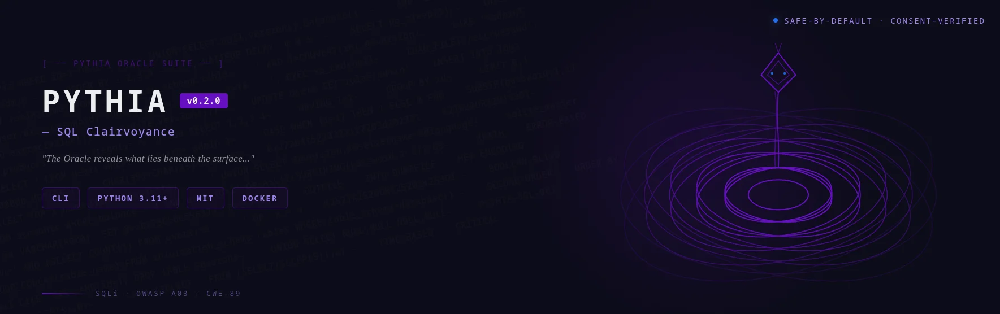
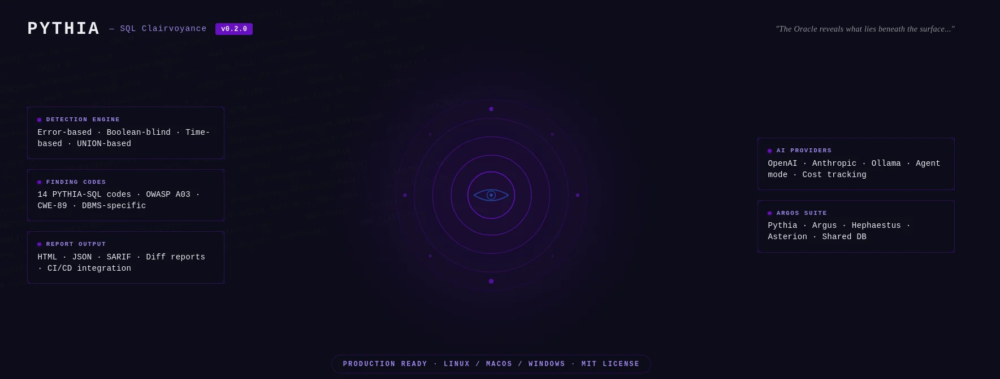
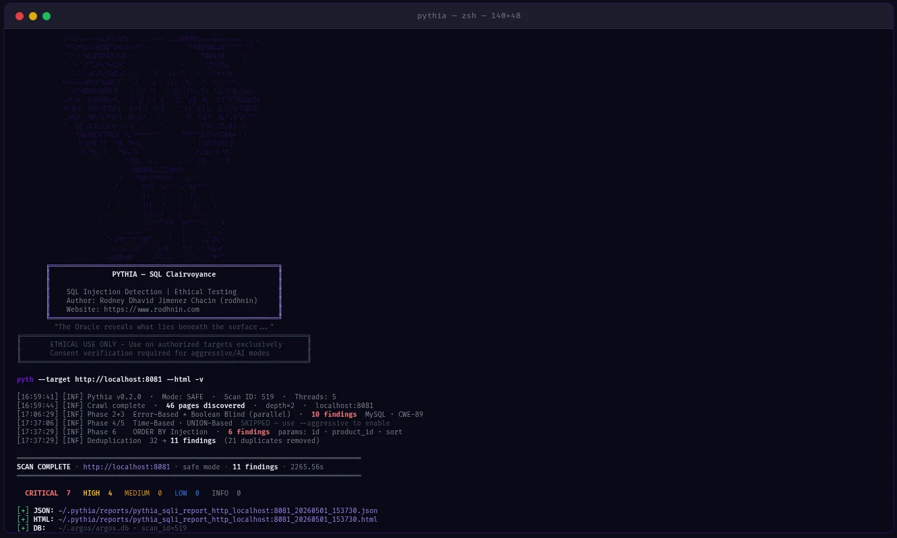
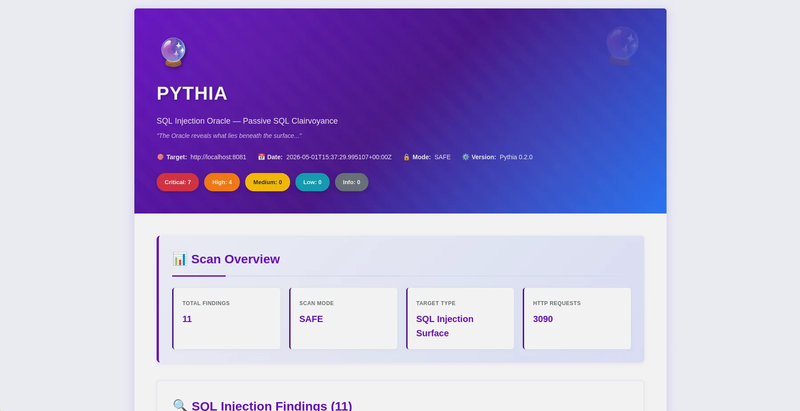
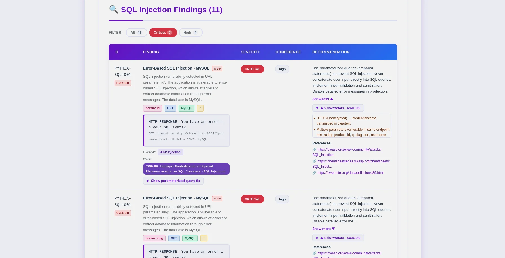

<div align="center">
  
</div>


<br>

<div align="center">

[](https://github.com/rodhnin/pythia-sql-clairvoyance/releases)
[](https://www.python.org/)
[](LICENSE)
[](docker/)
[](docs/ETHICS.md)
[](docs/ETHICS.md)

<br>

**Production-ready SQL injection scanner with 6 detection methods, AI-powered remediation, SARIF output, and CI/CD integration.**

<br>

[Quick Start](#-quick-start) &nbsp;·&nbsp;
[Documentation](docs/) &nbsp;·&nbsp;
[Docker](#-docker-deployment) &nbsp;·&nbsp;
[AI Analysis](#-ai-powered-analysis) &nbsp;·&nbsp;
[Star on GitHub](https://github.com/rodhnin/pythia-sql-clairvoyance)

</div>

<br>

<div align="center">
  
</div>

---

## In Action

<div align="center">
  
  <br><sub>Live scan · PHP vulnerable shop · 11 findings detected · safe mode · 2265.56s</sub>
</div>

<br>

<table width="100%"><tr>
<td width="50%" align="center">
  
  <br><sub>HTML report — findings overview with severity badges and OWASP mapping</sub>
</td>
<td width="50%" align="center">
  
  <br><sub>Findings table — PYTHIA-SQL codes, DBMS detection, CWE-89 mapping</sub>
</td>
</tr></table>

---

## What is Pythia?

Pythia is a **production-ready SQL injection detection scanner** that puts **ethics first**. Built for penetration testers, security researchers, and DevSecOps engineers, it identifies SQL injection vulnerabilities across 6 detection methods and integrates directly into CI/CD pipelines.

### Why Pythia?

- **Ethical by Design**: Consent token system prevents unauthorized scanning
- **Multi-Method Detection**: 6 detection techniques including second-order and ORDER BY injection
- **AI-Powered**: GPT, Claude, or local Ollama for intelligent remediation guides with code examples
- **CI/CD Ready**: `--fail-on`, `--sarif`, `--diff` flags for pipeline integration
- **Professional Reports**: HTML with filter bar + OWASP/CWE/CVE badges + JSON with contextual CVSS scoring
- **Persistent Tracking**: SQLite database shared with Argos Suite (`~/.argos/argos.db`)
- **High Accuracy**: False positive hardening with similarity scoring and multi-payload confirmation

### What It Detects

| Detection Method       | Description                                                        | Mode Required |
| ---------------------- | ------------------------------------------------------------------ | ------------- |
| **Error-Based**        | SQL errors in responses (MySQL, PostgreSQL, MSSQL, Oracle, SQLite) | Safe          |
| **Boolean-Blind**      | Response differences from TRUE/FALSE conditions                    | Safe          |
| **Time-Based Blind**   | Response delays from SLEEP/WAITFOR payloads                        | Aggressive    |
| **UNION-Based**        | Data extraction via UNION SELECT                                   | Aggressive    |
| **Second-Order**       | Store→retrieve injection patterns (POST→GET chain)                 | Aggressive    |
| **ORDER BY Injection** | Numeric sort parameter injection                                   | Aggressive    |

---

## Features

### Core SQL Injection Detection

```bash
# One command, comprehensive SQLi analysis
python -m pyth --target http://example.com/products?id=1 --html
```

- **14 Finding Codes**: DBMS-specific (MySQL, PostgreSQL, MSSQL, Oracle, SQLite) + technique-specific
- **DBMS Fingerprinting**: Automatic database type and version detection
- **WAF Bypass**: 170+ bypass payloads in aggressive mode (hex, URL encoding, inline comments, case variants)
- **Session-Variable Detection**: POST→GET chain for DVWA-high style authentication patterns
- **Smart Crawler**: BFS with popup/onclick extraction (`--js`), sitemap, robots.txt
- **False Positive Hardening**: SequenceMatcher similarity scoring + multi-payload confirmation

### CI/CD Integration

```bash
# Pipeline-friendly: exit 10 if high+ findings found
python -m pyth --target https://staging.app.com --aggressive --fail-on high
echo $?  # 0=clean, 10=findings found, 1=error

# SARIF for GitHub Security / GitLab SAST
python -m pyth --target https://app.com --aggressive --sarif > results.sarif

# Compare vs last scan — show what's new, what's fixed
python -m pyth --target https://app.com --aggressive --diff last --html
```

### Auth Headers

```bash
# Scan authenticated endpoints (JWT, API keys, custom cookies)
python -m pyth --target https://api.example.com/v1/users \
  --auth-header "Authorization: Bearer eyJhbGc..." \
  --auth-header "X-API-Key: sk-prod-xxx" \
  --aggressive --html
```

Pass `--auth-header` multiple times for multiple headers.

### AI-Powered Analysis

Choose your AI provider from the command line:

| Provider                         | Best For                          | Speed      | Cost        | Privacy      |
| -------------------------------- | --------------------------------- | ---------- | ----------- | ------------ |
| **OpenAI gpt-4o-mini** (default) | Production quality, low cost      | Fast       | ~$0.02/scan | Standard     |
| **Anthropic Claude**             | Privacy-focused, code remediation | Fast       | ~$0.06/scan | Enhanced     |
| **Ollama (Local)**               | Complete privacy                  | Slow (CPU) | Free        | 100% Offline |

```bash
# Standard analysis
python -m pyth --target http://example.com --use-ai --ai-tone technical --html

# Agent mode: AI queries NVD for real CVEs (no API key for NVD)
python -m pyth --target http://example.com --use-ai --ai-agent --html

# Multi-provider comparison
python -m pyth --target http://example.com --use-ai \
  --ai-compare "openai:gpt-4o-mini,anthropic:claude-3-5-haiku-20241022" --html

# With budget cap
python -m pyth --target http://example.com --use-ai --ai-budget 0.05 --html
```

### Professional Reporting

**JSON Reports** (Machine-Readable, v0.2.0 schema)

```json
{
    "tool": "pythia",
    "version": "0.2.0",
    "target": "http://localhost:8081",
    "mode": "aggressive",
    "summary": { "total": 26, "critical": 18, "high": 6, "medium": 2 },
    "findings": [
        {
            "id": "PYTHIA-SQL-001",
            "title": "Error-Based SQL Injection (MySQL/MariaDB)",
            "severity": "critical",
            "confidence": "high",
            "parameter": "id",
            "vector": "GET",
            "dbms": "MySQL 8.0.32",
            "cvss": 9.8,
            "contextual_score": 9.9,
            "risk_factors": ["no_ssl", "pii_detected"],
            "payload": "' OR '1'='1' --",
            "owasp": { "id": "A03", "name": "Injection" },
            "cwe": { "id": "CWE-89", "name": "SQL Injection" },
            "detection_method": "error-based"
        }
    ],
    "notes": {
        "scan_duration_seconds": 87.3,
        "requests_sent": 342,
        "rate_limit_applied": "5.0 req/s",
        "false_positive_disclaimer": "..."
    },
    "diff": null
}
```

**HTML Reports** (Human-Friendly)

- Filter bar: severity, OWASP category, detection method, DBMS
- OWASP/CWE/CVE badges per finding (clickable to external references)
- CVSS base + contextual score with color coding
- Expandable evidence sections with payload visualization
- AI analysis tabs (standard / agent / compare)
- Diff section (new/fixed/persisting findings)
- Oracle theme (purple `#6a11cb`) — deliverable to clients without editing

### Finding Codes

All codes → **OWASP A03 Injection** / **CWE-89 SQL Injection**

| Code             | Type               | DBMS / Vector            | Mode       |
| ---------------- | ------------------ | ------------------------ | ---------- |
| `PYTHIA-SQL-001` | Error-Based        | MySQL / MariaDB          | Safe       |
| `PYTHIA-SQL-002` | Error-Based        | PostgreSQL               | Safe       |
| `PYTHIA-SQL-003` | Error-Based        | MSSQL                    | Safe       |
| `PYTHIA-SQL-004` | Error-Based        | Oracle                   | Safe       |
| `PYTHIA-SQL-005` | Error-Based        | SQLite                   | Safe       |
| `PYTHIA-SQL-010` | Boolean Blind      | Any DBMS                 | Safe       |
| `PYTHIA-SQL-011` | Boolean Blind      | Via header injection     | Safe       |
| `PYTHIA-SQL-020` | Time-Based         | MySQL SLEEP()            | Aggressive |
| `PYTHIA-SQL-021` | Time-Based         | MSSQL WAITFOR            | Aggressive |
| `PYTHIA-SQL-022` | Time-Based         | PostgreSQL pg_sleep()    | Aggressive |
| `PYTHIA-SQL-030` | UNION-Based        | GET/POST parameter       | Aggressive |
| `PYTHIA-SQL-031` | UNION-Based        | Via cookie               | Aggressive |
| `PYTHIA-SQL-040` | Second-Order       | Store → retrieve pattern | Aggressive |
| `PYTHIA-SQL-050` | ORDER BY Injection | Numeric sort parameter   | Aggressive |

---

## Validation & Testing

Pythia v0.2.0 has been **empirically validated** using controlled Docker-based vulnerable applications.

### QA Results (May 2026)

| Target                  | Mode                              | Findings        | Notes                                      |
| ----------------------- | --------------------------------- | --------------- | ------------------------------------------ |
| **PHP Lab** (8081)      | `--aggressive`                    | **26 findings** | All 4 techniques + second-order + ORDER BY |
| **Flask Lab** (8082)    | `--js --aggressive`               | **18 findings** | Session-var + second-order + ORDER BY      |
| **DVWA Low**            | `--no-crawl --aggressive`         | 4/4 techniques  | PYTHIA-SQL-001/010/020/030                 |
| **DVWA Medium**         | `--no-crawl --aggressive`         | 4/4 techniques  | POST form, all techniques                  |
| **DVWA High**           | `--js --max-pages 2 --aggressive` | 4/4 techniques  | Session-variable POST→GET chain            |
| **False Positive Test** | `--aggressive`                    | **0 findings**  | Static URL — confirmed no false positives  |

**Key Validations:**

- ✅ All 14 finding codes functional
- ✅ DVWA high (session-variable pattern) — full 4/4 parity
- ✅ Second-order detection (PYTHIA-SQL-040)
- ✅ ORDER BY injection detection (PYTHIA-SQL-050)
- ✅ Zero false positives on static URLs
- ✅ `--fail-on` exit codes (0/10/1) correct
- ✅ SARIF 2.1.0 output validates
- ✅ `--diff last` comparison working
- ✅ `--auth-header` passes headers through all requests

---

## Quick Start

### Prerequisites

- **Python 3.11+** (3.12 recommended)
- **pip** (Python package manager)
- **Docker** (optional, for vulnerable labs)

### Installation

**1. Clone the repository**

```bash
git clone https://github.com/rodhnin/pythia-sql-clairvoyance.git
cd pythia-sql-clairvoyance
```

**2. Create and activate virtual environment**

```bash
python3 -m venv .venv
source .venv/bin/activate
```

**3. Install dependencies**

```bash
python -m pip install --upgrade pip
python -m pip install -r requirements.txt
```

**4. Configure API keys (if using cloud AI)**

```bash
export OPENAI_API_KEY="sk-..."
export ANTHROPIC_API_KEY="sk-ant-..."
```

**5. Verify installation**

```bash
python -m pyth --version
# Output: Pythia v0.2.0
```

### Your First Scan

```bash
# Basic scan (safe mode, no consent required)
python -m pyth --target "http://testphp.vulnweb.com/artists.php?artist=1"

# With HTML report
python -m pyth --target "http://testphp.vulnweb.com/artists.php?artist=1" --html

# Aggressive mode (requires consent)
python -m pyth --gen-consent example.com
python -m pyth --verify-consent http --domain example.com --token verify-abc123
python -m pyth --target http://example.com --aggressive --html
```

Reports saved to `~/.pythia/reports/`.

---

## Usage Guide

### CLI Flags Reference

```
Scan Options:
  --target URL          Target URL to scan
  --safe                Safe mode (default): error-based + boolean-blind
  --aggressive          Aggressive mode: all 6 techniques + WAF bypass payloads

Auth:
  --cookie COOKIE       Session cookie string
  --auth-header HEADER  Custom HTTP header (pass multiple times for multiple headers)
  --auto-csrf           Automatically detect and include CSRF tokens

Crawler:
  --max-depth N         Max crawl depth (default: 2)
  --max-pages N         Max pages to crawl (default: 100)
  --no-robots           Ignore robots.txt
  --no-crawl            Skip BFS crawl, test target URL only
  --js                  JS-aware popup/onclick URL extraction

Output:
  --report-dir DIR      Output directory for reports (default: ~/.pythia/reports/)
  --html                Generate HTML report
  --db                  Save findings to database
  --diff SCAN_ID        Compare vs previous scan (use "last" for most recent)
  --sarif               Output SARIF 2.1.0 to stdout (logs redirect to stderr)
  --fail-on SEVERITY    Exit 10 if findings found at this severity or higher

CI/CD:
  --fail-on SEVERITY    Exit codes: 0=clean, 10=findings found, 1=error

Logging:
  -v / -vv / -vvv       Verbosity levels
  -q                    Quiet mode (errors only)
  --log-file FILE       Log to file
  --log-json            Structured JSON logging
  --no-color            Disable colored output

AI:
  --use-ai              Enable AI analysis
  --ai-tone TONE        Analysis tone: technical, non_technical, both
  --api-key-env VAR     Environment variable name for API key
  --ai-provider NAME    AI provider: openai, anthropic, ollama
  --ai-model MODEL      Model name (e.g. gpt-4o-mini, claude-3-5-haiku-20241022)
  --ai-stream           Stream AI output token by token
  --ai-compare LIST     Compare providers (e.g. "openai,anthropic" or "openai:gpt-4o-mini,anthropic:claude-3-5-haiku-20241022")
  --ai-agent            Agent mode: NVD CVE lookup + iterative analysis
  --ai-budget AMOUNT    Cost cap per scan in USD

Consent:
  --gen-consent DOMAIN  Generate consent token for domain
  --verify-consent METHOD  Verify consent: http or dns
  --domain DOMAIN       Domain for consent verification
  --token TOKEN         Consent token value

Advanced:
  --rate N              Request rate limit (default: 2.0 safe, 5.0 aggressive)
  --timeout N           HTTP timeout in seconds (default: 10)
  --user-agent STRING   Custom User-Agent
  --no-verify-ssl       Disable SSL verification
  --threads N           Worker threads (default: 5)
  --version             Show version and exit
```

### Basic Scanning

```bash
# Safe mode (default) - error-based + boolean-blind
python -m pyth --target "http://example.com/search?q=test"

# Generate HTML report
python -m pyth --target "http://example.com/products?id=1" --html

# Increase verbosity
python -m pyth --target "http://example.com/api/users?id=1" -vv

# Skip crawler, test target URL directly
python -m pyth --target "http://example.com/api/users?id=1" --no-crawl
```

### CI/CD Integration

```bash
# Exit 10 if high or critical findings exist (blocks pipeline)
python -m pyth \
  --target https://staging.myapp.com \
  --aggressive \
  --fail-on high

# SARIF output for GitHub Security tab
python -m pyth \
  --target https://staging.myapp.com \
  --aggressive \
  --sarif > results.sarif

# Compare vs last scan to see what changed
python -m pyth \
  --target https://staging.myapp.com \
  --aggressive \
  --diff last \
  --html
```

### Authenticated Scanning

```bash
# JWT Bearer token
python -m pyth \
  --target https://api.example.com/v1/products \
  --aggressive \
  --auth-header "Authorization: Bearer eyJhbGc..." \
  --html

# Multiple headers
python -m pyth \
  --target https://api.example.com/v1/users \
  --aggressive \
  --auth-header "Authorization: Bearer eyJhbGc..." \
  --auth-header "X-API-Key: sk-prod-xxx" \
  --html

# Session cookie (DVWA example)
python -m pyth \
  --target "http://localhost:8080/vulnerabilities/sqli/?id=1&Submit=Submit" \
  --no-crawl \
  --aggressive \
  --cookie "PHPSESSID=abc123; security=low"
```

### JS-Aware Crawling

```bash
# Extract popup/onclick URLs for complex navigation patterns
python -m pyth \
  --target http://localhost:8082 \
  --js \
  --aggressive \
  --html

# DVWA high: session-variable form (needs popup URL extraction)
python -m pyth \
  --target "http://localhost:8080/vulnerabilities/sqli/" \
  --js \
  --max-pages 2 \
  --aggressive \
  --cookie "PHPSESSID=abc123; security=high"
```

The `--js` flag uses regex extraction from `onclick` attributes — no Playwright dependency required.

### Aggressive Mode

```bash
# Step 1: Generate consent token
python -m pyth --gen-consent example.com
# Output: Token: verify-a3f9b2c1d8e4...

# Step 2: Place token at https://example.com/.well-known/verify-a3f9b2c1d8e4.txt

# Step 3: Verify consent
python -m pyth --verify-consent http \
  --domain example.com \
  --token verify-a3f9b2c1d8e4

# Step 4: Run aggressive scan (all 6 techniques + WAF bypass)
python -m pyth \
  --target http://example.com \
  --aggressive \
  --html -v
```

---

## Docker Deployment

Pythia provides two Docker deployment options:

1. **Scanner Image**: Build Pythia as a Docker image for one-shot scans
2. **Testing Lab**: Vulnerable applications (DVWA, PHP, Flask) for safe testing

### Quick Start

```bash
cd docker
./deploy.sh
```

### Testing Lab (Vulnerable Applications)

**NEVER expose testing lab to public internet — LOCAL TESTING ONLY!**

```bash
# Start vulnerable applications
sudo docker compose -f docker/compose.testing.yml up -d

# Expected targets:
# DVWA:       http://localhost:8080
# PHP Shop:   http://localhost:8081
# Flask Blog: http://localhost:8082

# Scan from host
python -m pyth --target http://localhost:8081 --aggressive --html

# Stop lab
sudo docker compose -f docker/compose.testing.yml down
```

---

## AI-Powered Analysis

Pythia uses **LangChain v1.0.0** with support for multiple AI providers.

### Two Analysis Modes

- **Technical**: Prepared statements, parameterized queries, input validation code (PHP/PDO, Python/SQLAlchemy, Node.js/pg, Java/PreparedStatement)
- **Executive**: Plain-language risk assessment for stakeholders and management

### Switching Providers

```bash
# CLI flags (v0.2.0) — no YAML editing required
python -m pyth --target http://example.com --use-ai --ai-provider anthropic --ai-model claude-3-5-haiku-20241022 --html
python -m pyth --target http://example.com --use-ai --ai-provider ollama --ai-model llama3.2 --html
```

YAML config (`config/default.yaml`) can still be used as fallback. CLI flags take priority.

For complete AI integration guide, see [docs/AI_INTEGRATION.md](docs/AI_INTEGRATION.md)

---

## Understanding Reports

### Report Files

```
~/.pythia/
├── reports/
│   ├── pythia_sqli_report_localhost_20260318_143022.json
│   └── pythia_sqli_report_localhost_20260318_143022.html
~/.argos/
├── argos.db           # Shared Argos Suite database
├── costs.json         # AI cost tracking (shared)
└── logs/
    └── pythia.log     # Scan logs
```

### Severity Mapping

- **CRITICAL (9.0-10.0)**: Error-based, time-based, UNION-based, second-order with confirmed exploitation
- **HIGH (7.0-8.9)**: Boolean-blind (high confidence), ORDER BY injection
- **MEDIUM (4.0-6.9)**: Boolean-blind (medium confidence)
- **LOW (0.1-3.9)**: Potential SQLi with inconclusive evidence

### Exit Codes

| Code  | Meaning                                                                       |
| ----- | ----------------------------------------------------------------------------- |
| `0`   | Scan completed, no findings at `--fail-on` threshold (or no `--fail-on` used) |
| `1`   | Technical error (connection, timeout, database)                               |
| `10`  | Findings found at or above `--fail-on` severity threshold                     |
| `130` | User cancelled (Ctrl+C)                                                       |

---

## Database Persistence

SQLite database **shared with Argos ecosystem** (`~/.argos/argos.db`):

- **Scan History**: Date, duration, findings count, detection methods
- **Finding Repository**: Searchable SQL injection vulnerability database
- **Verified Domains**: Consent token tracking with expiration
- **AI Costs**: Per-scan cost tracking (new in v0.2.0)

```bash
# Query recent Pythia scans
sqlite3 ~/.argos/argos.db "SELECT * FROM scans WHERE tool='pythia' ORDER BY scan_id DESC LIMIT 10"

# Find critical SQL injections
sqlite3 ~/.argos/argos.db "SELECT * FROM findings WHERE severity='critical' AND scan_id IN (SELECT scan_id FROM scans WHERE tool='pythia')"

# View AI cost summary
sqlite3 ~/.argos/argos.db "SELECT provider, model, ROUND(SUM(cost_usd),4) FROM ai_costs WHERE tool='pythia' GROUP BY provider, model"
```

---

## Project Structure

```
pythia-sql-clairvoyance/
├── pyth/
│   ├── checks/
│   │   ├── crawler.py          # BFS web crawler (JS-aware with --js)
│   │   ├── error_based.py      # PYTHIA-SQL-001..005
│   │   ├── boolean_blind.py    # PYTHIA-SQL-010..011
│   │   ├── time_based.py       # PYTHIA-SQL-020..022
│   │   ├── union_based.py      # PYTHIA-SQL-030..031
│   │   ├── second_order.py     # PYTHIA-SQL-040
│   │   ├── order_injection.py  # PYTHIA-SQL-050
│   │   ├── waf_bypass.py       # WAF bypass payloads (aggressive only)
│   │   └── forms.py            # Form analysis
│   ├── core/
│   │   ├── ai.py               # AI integration + AICostTracker
│   │   ├── config.py           # Config loader
│   │   ├── consent.py          # Consent token system
│   │   ├── cve_lookup.py       # NVD CVE API client
│   │   ├── db.py               # ArgosDB (shared SQLite)
│   │   ├── diff.py             # Diff reports
│   │   ├── http_client.py      # Rate-limited HTTP session
│   │   ├── logging.py          # Structured logging + secret redaction
│   │   ├── owasp.py            # OWASP/CWE mapper
│   │   ├── report.py           # Report generation (JSON + HTML + SARIF)
│   │   └── risk_scoring.py     # Contextual CVSS scoring
│   ├── cli.py                  # CLI argument parser (35+ flags)
│   ├── scanner.py              # Main scan orchestrator
│   └── __init__.py             # version = "0.2.0"
├── config/
│   ├── default.yaml
│   └── prompts/                # AI prompt templates
├── db/migrate.sql              # Shared DB schema
├── schema/report.schema.json   # JSON Schema Draft 2020-12
├── templates/report.html.j2    # HTML template (oracle purple theme)
├── docker/                     # Docker deployment + vulnerable labs
└── docs/
    ├── AI_INTEGRATION.md
    ├── CONSENT.md
    ├── DATABASE_GUIDE.md
    ├── ETHICS.md
    ├── REPORT_FORMAT.md
    ├── ROADMAP.md
    └── TESTING_GUIDE.md
```

---

## Roadmap

### v0.1.0 — Initial Release (November 2025)

**Status:** Released

- 4 detection methods, AI remediation, consent system, HTML+JSON reports, SQLite persistence

### v0.2.0 — Full Parity & Enterprise Features (May 2026)

**Status:** Released

- 6 detection methods (added second-order + ORDER BY)
- 14 DBMS-specific finding codes
- CI/CD integration (`--fail-on`, `--sarif`, `--diff`)
- Auth headers, JS-aware crawling, WAF bypass payloads
- AI: streaming, compare, agent (NVD CVE lookup), cost tracking, `--ai-provider`/`--ai-model` flags
- OWASP/CWE/CVSS/contextual risk scoring in every finding
- False positive hardening (similarity scoring, multi-payload confirmation)
- DVWA high security parity (session-variable chain)

### v0.3.0 — Pytest Suite & Developer Tooling (Q3 2026)

**Planned:**

- 40+ pytest tests covering all 14 finding codes
- Interactive config management (`python -m pyth config set`)
- Database CLI (`python -m pyth db scans list`)
- Session expiry detection during authenticated scans
- Multi-site batch scanning (`--targets targets.txt`)

### v0.4.0 — Intelligence & Automation (Q1 2027)

**Planned:**

- ML-based anomaly detection
- Automated read-only exploitation (proof of impact)
- AI chat interface for scan result analysis

For detailed feature descriptions, see [docs/ROADMAP.md](docs/ROADMAP.md)

---

## Ethics & Legal

### The Golden Rule

**Only scan systems you own or have explicit written permission to test.**

### Consent Enforcement

| Mode            | Tests                      | Consent Required | Rate Limit |
| --------------- | -------------------------- | ---------------- | ---------- |
| **Safe**        | Error-Based, Boolean-Blind | No               | 2.0 req/s  |
| **Aggressive**  | All 6 techniques           | Yes              | 5.0 req/s  |
| **AI Analysis** | Remediation guide          | Yes              | N/A        |

### Legal Framework

- USA: Computer Fraud and Abuse Act (CFAA)
- UK: Computer Misuse Act 1990
- EU: Directive 2013/40/EU
- International: Various cybercrime laws

For complete ethical guidelines, see [docs/ETHICS.md](docs/ETHICS.md)

---

## Contributing

We welcome contributions — bug reports, feature requests, documentation improvements, and code contributions.

### How to Contribute

1. Fork the repository
2. Create a feature branch (`git checkout -b feature/amazing-feature`)
3. Make your changes and write tests
4. Commit your changes
5. Push to the branch and open a Pull Request

### Development Setup

```bash
git clone https://github.com/YOUR-USERNAME/pythia-sql-clairvoyance.git
cd pythia-sql-clairvoyance
python -m pip install -r requirements.txt
python -m pip install pytest black flake8 mypy
black pyth/
flake8 pyth/
pytest tests/
```

---

## Documentation

| Document                                    | Description                                                          |
| ------------------------------------------- | -------------------------------------------------------------------- |
| [AI_INTEGRATION.md](docs/AI_INTEGRATION.md) | Complete AI setup guide (providers, streaming, agent, cost tracking) |
| [CONSENT.md](docs/CONSENT.md)               | Consent token system technical details                               |
| [DATABASE_GUIDE.md](docs/DATABASE_GUIDE.md) | SQLite schema v1.1, queries, ai_costs table                          |
| [ETHICS.md](docs/ETHICS.md)                 | Legal framework and ethical guidelines                               |
| [REPORT_FORMAT.md](docs/REPORT_FORMAT.md)   | Full JSON schema, SARIF, diff format                                 |
| [ROADMAP.md](docs/ROADMAP.md)               | Feature history and development plans                                |
| [TESTING_GUIDE.md](docs/TESTING_GUIDE.md)   | Docker lab setup and v0.2.0 test scenarios                           |

---

## License

This project is licensed under the **MIT License** — see the [LICENSE](LICENSE) file for details.

---

## Disclaimer

**IMPORTANT:** This tool is for **authorized security testing only**.

By using Pythia, you acknowledge and agree that:

1. You will **only scan systems you own** or have **explicit written permission** to test
2. You will **comply with all applicable laws** and regulations
3. You understand that **unauthorized access is illegal** (CFAA, Computer Misuse Act, etc.)
4. The author and contributors **assume no liability** for misuse

---

## Acknowledgments

- **OWASP** — SQL Injection guidance, Testing Guide
- **SQLMap** — Inspiration for detection methods and techniques
- **PortSwigger** — Web Security Academy resources
- **LangChain** — AI framework for intelligent analysis
- **Anthropic & OpenAI** — AI models for vulnerability remediation
- **Ollama** — Local AI inference for privacy-focused scanning
- **NVD/NIST** — CVE data via free public API

---

## Author

**Rodney Dhavid Jimenez Chacin (rodhnin)**

- Website: [rodhnin.com](https://rodhnin.com)
- GitHub: [@rodhnin](https://github.com/rodhnin)
- Project: [pythia-sql-clairvoyance](https://github.com/rodhnin/pythia-sql-clairvoyance)

---

<div align="center">

**Built for ethical hackers, penetration testers, and DevSecOps engineers worldwide**

[Report Bug](https://github.com/rodhnin/pythia-sql-clairvoyance/issues) • [Request Feature](https://github.com/rodhnin/pythia-sql-clairvoyance/issues) • [Documentation](docs/)

---

_Pythia v0.2.0 — May 2026_

</div>
